
<h1 align="center">智能社区管理系统的设计与实现+vue</h1>

## 简介
智能社区管理系统：提供安保维护、论坛、公告、社区活动、公共场所预约、用户管理等功能，实现社区信息的高效管理和便捷服务。    --计算机毕业设计源码；毕设源码；java毕业设计源码

## 联系方式

<h3 align="center">获取完整代码与数据库文件 + 微信：deepguan QQ: 86050149 QQ群: 783742310</h3>

<h3 align="center">可帮忙远程部署 包运行成功！提供远程部署、修改代码、设计文档指导、代码讲解等服务！</h3>

## 功能介绍（完整见运行截图）
管理员：  
基本功能：登录，注册，退出  
网站首页：主导航栏，轮播图，新闻公告展示，社区活动推送  
社区管理：公共场所预约管理，公告发布与管理，论坛管理  
安全与服务：安保维护信息查看，用户管理，政务服务管理  
其他功能：留言管理，社区活动管理与审核，消息提醒  

用户：  
基本功能：登录，注册，退出  
网站首页：主导航栏，新闻公告，活动推送，论坛入口  
社区服务：公共场所预约，论坛发帖与评论，留言板使用  
个人中心：个人信息管理，社区活动报名，公告查看，公共场所预约管理  
社区互动：参与论坛讨论，查看社区公告，查询社区活动信息  

系统用户：  
功能模块：社区管理，活动组织与发布，公告管理与审核，论坛管理  
数据管理：公共场所信息录入与修改，社区公告发布，活动信息编辑与查询  
安全管理：用户权限管理，社区设备与安保监控，系统数据备份与恢复  
服务功能：个人信息管理，政务服务查询与操作，留言信息管理  

访客：  
基本功能：浏览社区新闻与活动信息，参与论坛讨论  
服务功能：查看社区公告与活动详情，查询公共场所预约信息  
互动功能：发布留言，评论社区活动与新闻  
用户体验：无需登录即可查看公共信息，提供留言板进行互动

## 运行截图
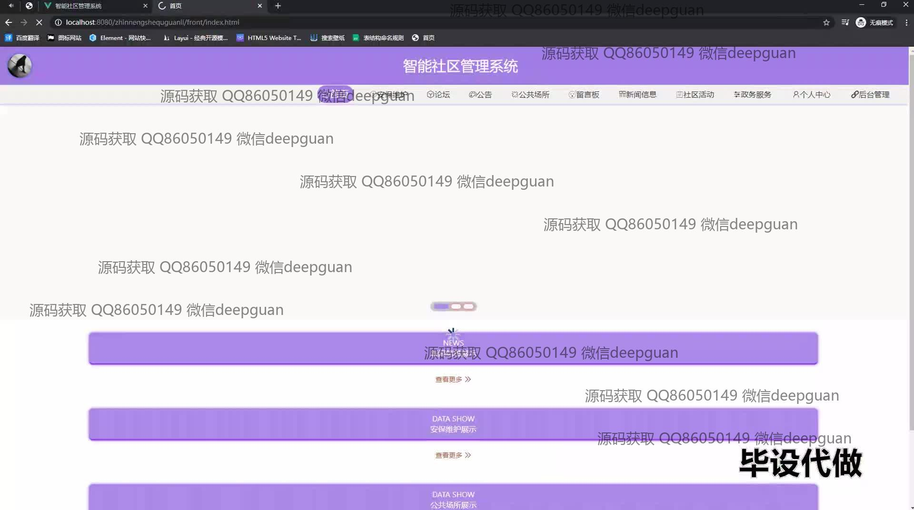
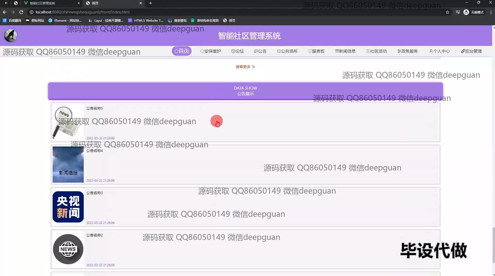
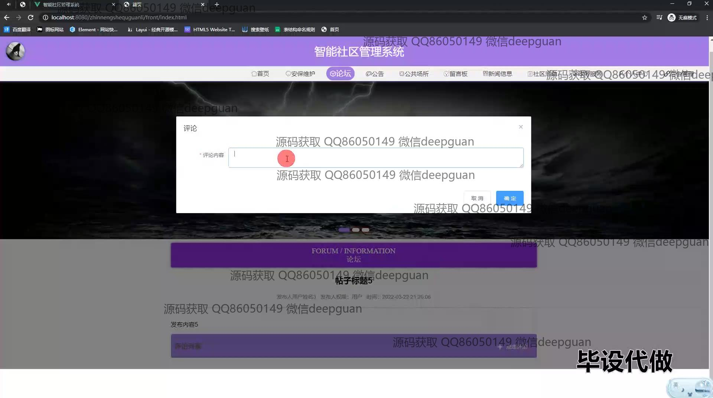
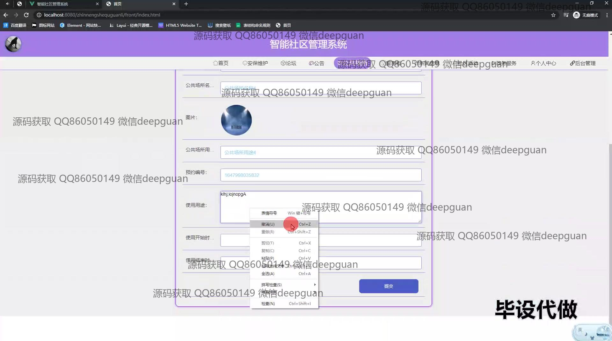
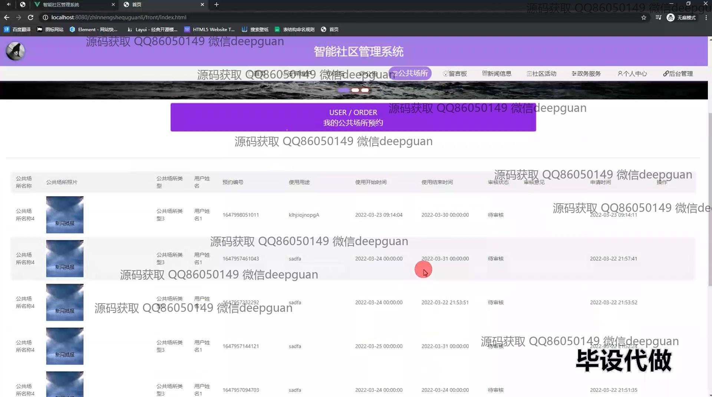
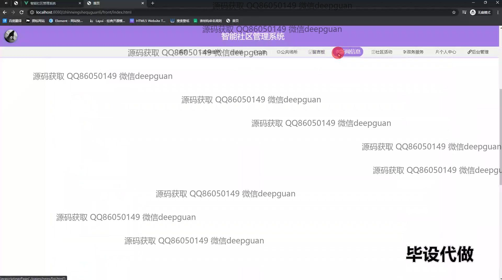
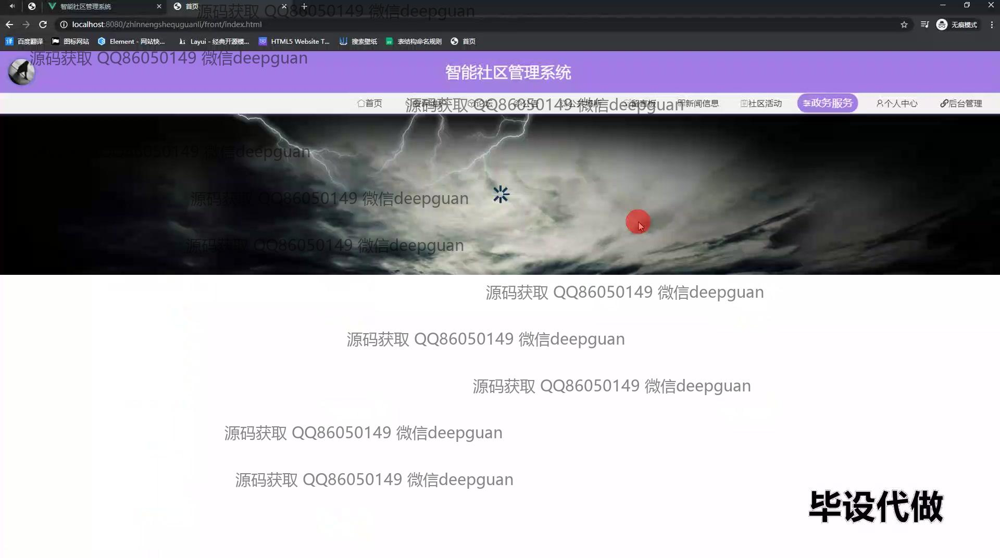

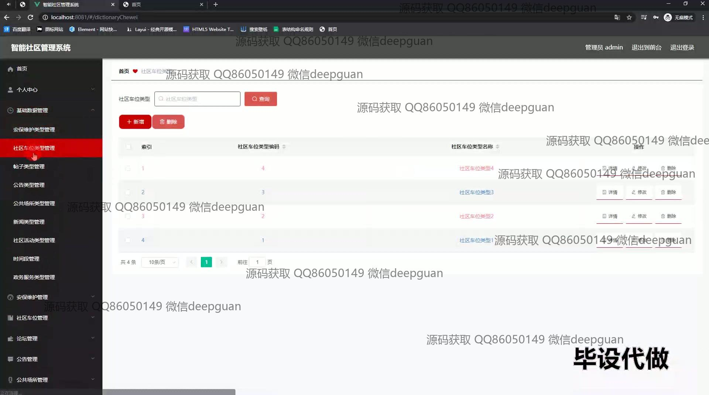
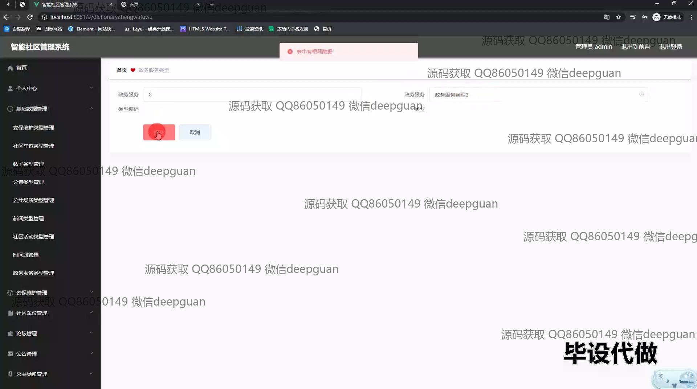
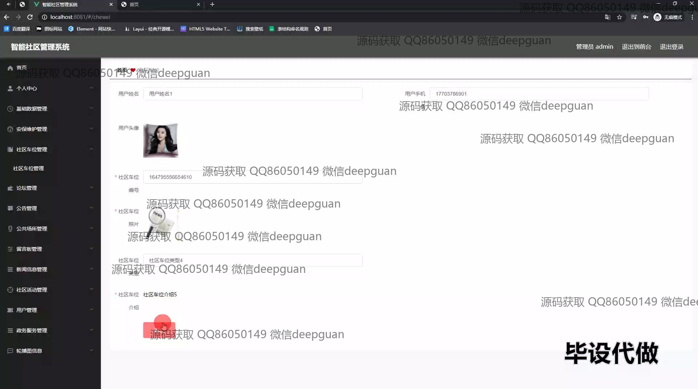
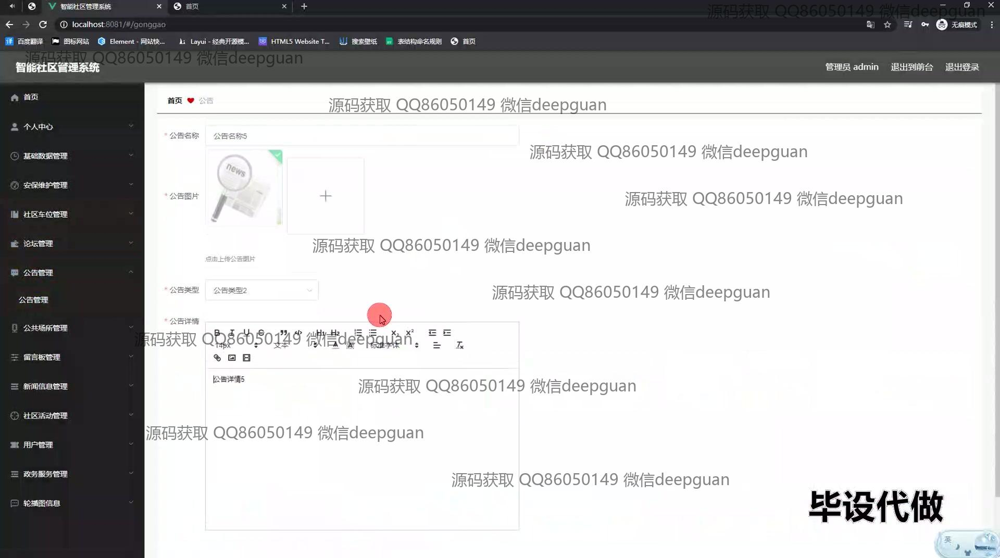
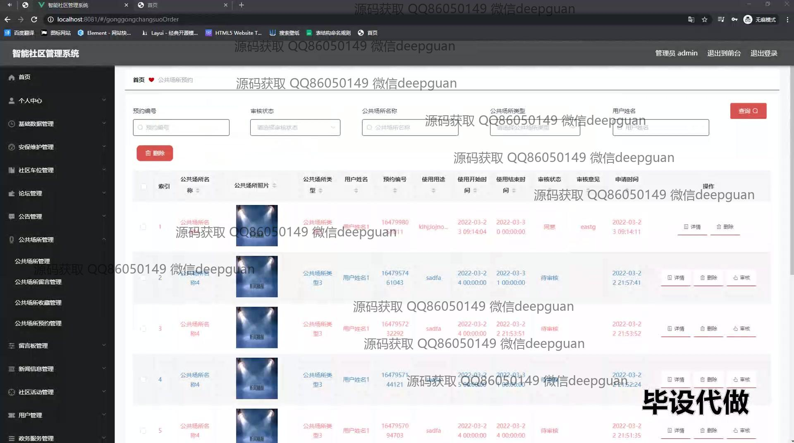
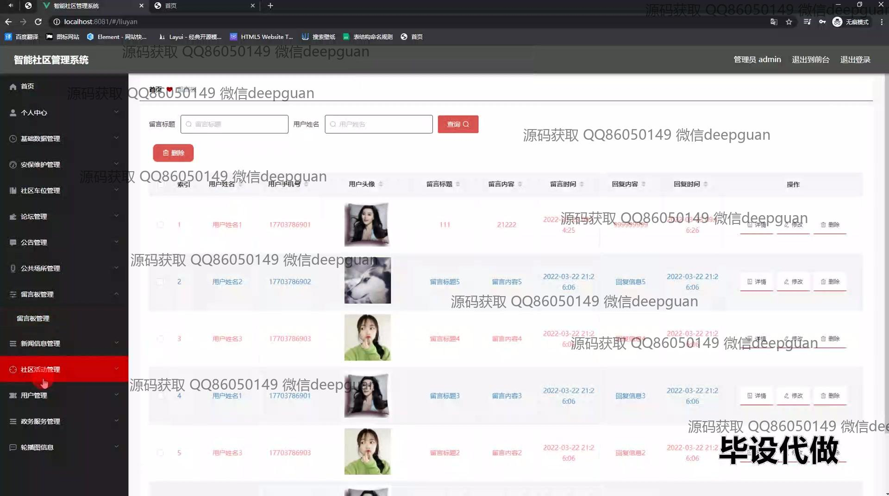
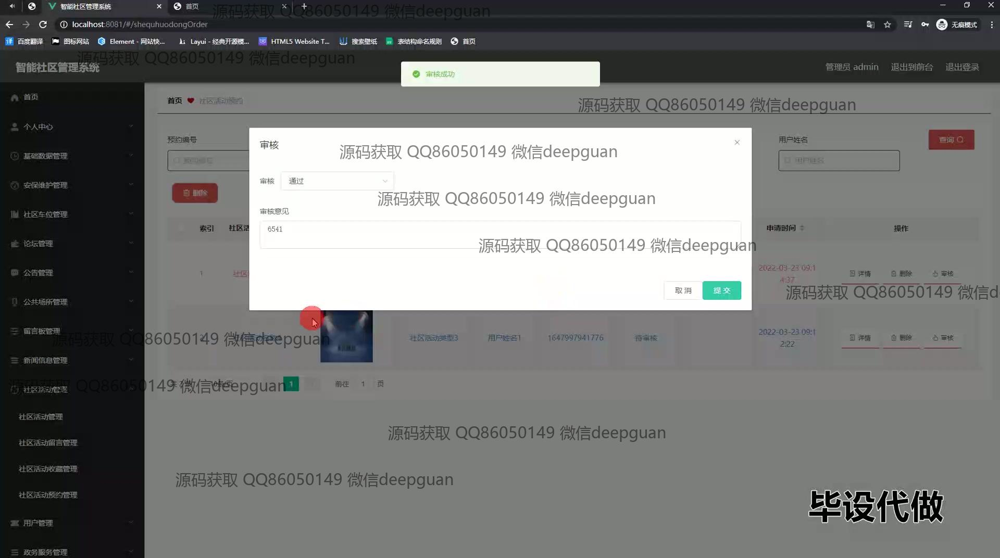
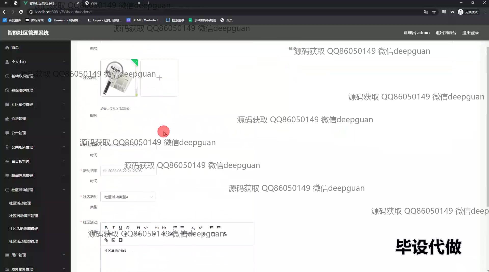
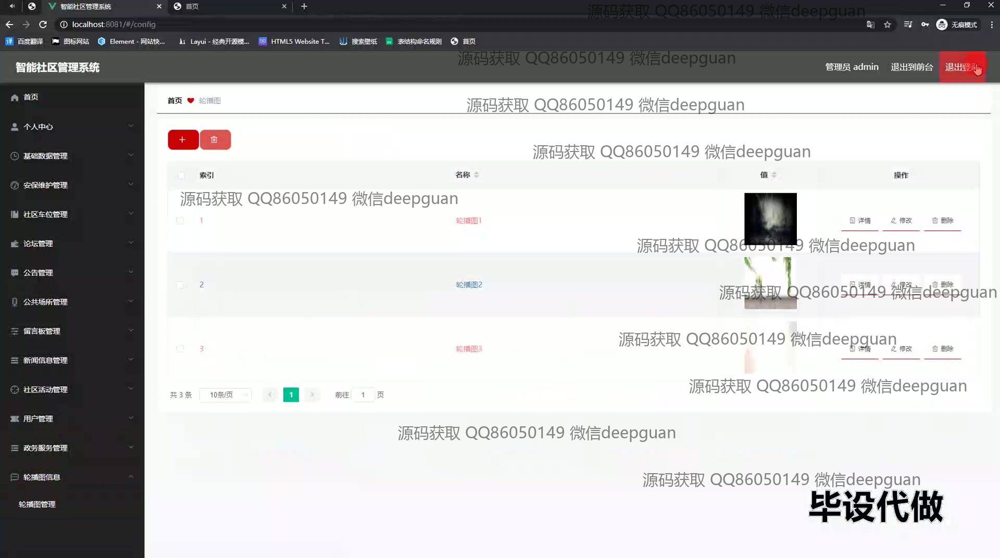
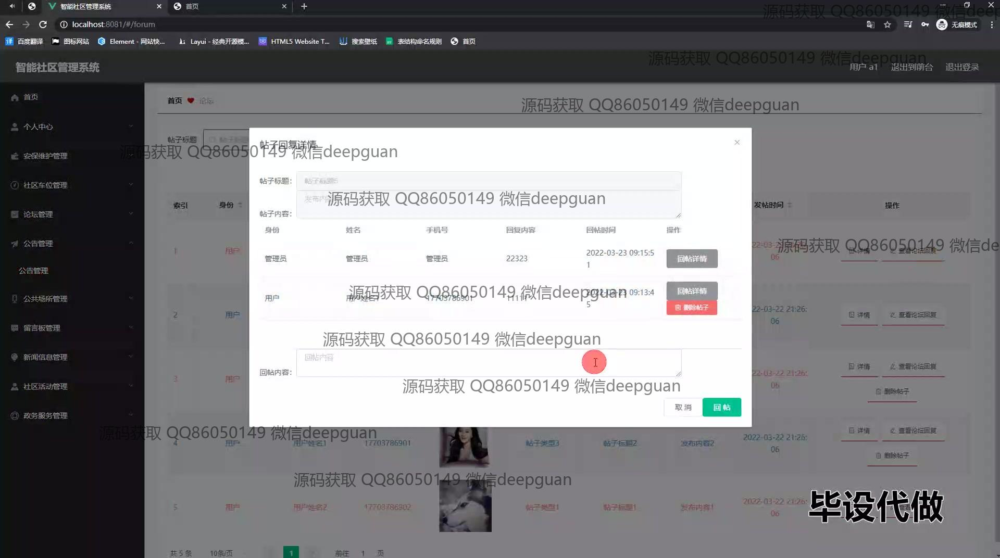
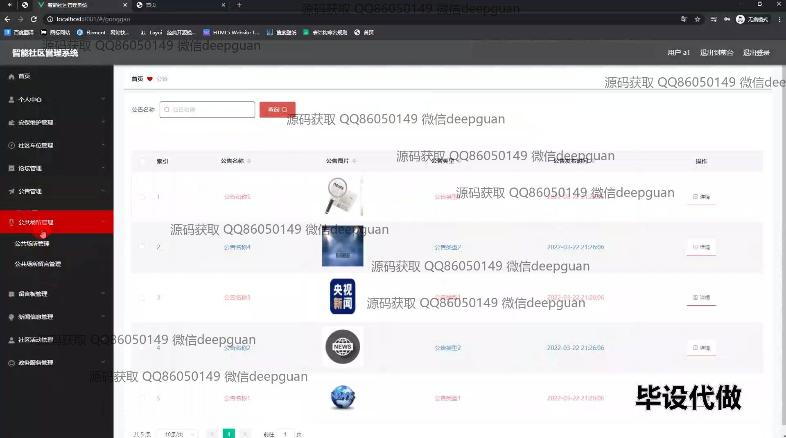
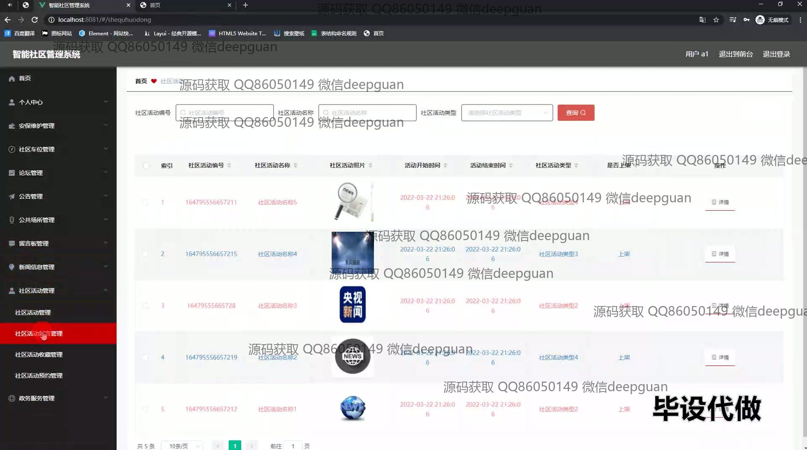

本代码来源于网络,仅供学习参考使用!

